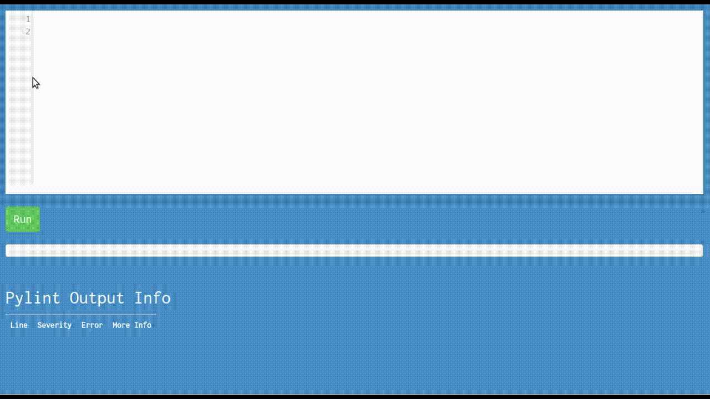

# PythonBuddy 🖊️ 🐍 
[](https://travis-ci.org/ethanchewy/OnlinePythonLinterSyntaxChecker)
<br>
Online Python 2.7 Programming with Live Pylint Syntax Checking!
<br>


### Usage
1) Fetch from repo:
  ```
  git clone https://github.com/ethanchewy/OnlinePythonLinterSyntaxChecker.git
  ```
2) Change to directory 
  ```
  cd OnlinePythonLinterSyntaxChecker
  ```
2) Create virtualenv based on your own system:
  ```
  virtualenv -p /usr/bin/python2.7 venv
  ```
3) Activate vitrual environment:
  ```
  source venv/bin/activate
  ```
4) Pipe requirements to venv folder:
  ```
  pip install -r requirements.txt
  ```
5) Set FLASK_APP variable:
  ```
  export FLASK_APP=app.py
  ```
6) Run flask app:
  ```
  flask run
  ```
  Open your browser to [localhost:5000](http://localhost:5000) . Voila! 🎉
### Current Features:
<br>
<li>Live Syntax Checking
  <ul>
    <li>Uses Pylint as checker (only prints out errors and warnings)</li>
    <li>Syntax Highlighting</li>
  </ul>
</li>


<br>
<li>Python 2.7 Execution
  <ul>
    <li>Python 2.7 Complilation</li>
    <li>Basic Sandboxing</li>
  </ul>
</li>


<br>
<li>Live Error Table with Additional Help Suggestions</li>


<br>

### Customizing Options

1. Edit app.py to change any pylint options (like showing/hiding hints warnings)
2. Want Python 3? 
 1. Change step 2 from the installation instructions to: 
    ```
    virtualenv --python=/usr/bin/python3.2 venv
    ```
 2. Follow rest of instructions
3. Security
 1. To create a much more secure Python Environment, consider using RestrictedPython: https://github.com/ethanchewy/OnlinePythonLinterSyntaxChecker/tree/restrictedpython
 2. For more security but enough flexibility, you could restrict the temp.py python file without read/write permissions via these instuctions: http://stackoverflow.com/questions/186202/what-is-the-best-way-to-open-a-file-for-exclusive-access-in-python

### Future Goals:
- Make easily embeddable for MOOCs like edX and other education platform
- Create an analytics system that models the student's python learning and tells them where they need improvement (many programming students learn by copying and pasting and don't actually understand the nuances of the Python language).
- Stricter Python Sandboxing via Pypy's sandboxing solution
- Lower CPU usage
- Allow users to generate a link to a unique code snippet similar to JSBin

### FAQ:
Why did you make this? <br>
I made this so that MOOCs like edX or codecademy could easily embed and use this on their courses so students wouldn't have to go through the frustrations of setting up a Python environment and jump right into Python programming. Also, professors and teachers could easily set up a server and allow students to quickly test out their code with PythonBuddy online.

Has anyone created anything like this before? <br>
There has never been a live syntax checker for python online. Similar projects that are not "live" are http://pep8online.com/ and http://antares.sip.ucm.es/cesar/pylint/

Has can I contribute? <br>
You can 🌟 star my repo, fork my repo, submit a pull request, and/or open issues!

Where's the code for embedding it in MOOCs? <br>
I'm currently working on this over here (for edx specifically): https://github.com/ethanchewy/pybuddy2.0 . If you want to embed this project directly to your site, you would use an iframe:
```
<iframe src="https://pythonbuddy.com"></iframe>
```

I want the code to actually compile and run in a certain way?
If you want to actually execute the python safely look at my XBlock code: https://github.com/ethanchewy/pybuddy2.0 . Remember to sandbox the code with RestrictedPython or something.

How do I run my own server?
https://github.com/ethanchewy/OnlinePythonLinterSyntaxChecker/wiki

### Credits:
This was made by Ethan Chiu as a research project under the guidance of Wellesley College professor Eni Mustafaraj.
