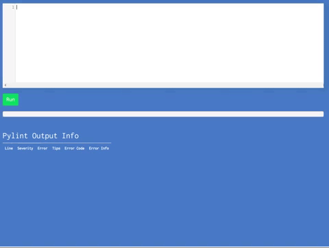
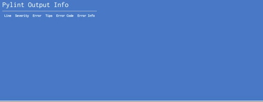

# PythonBuddy 🖊️ 🐍
[](https://travis-ci.org/ethanchewy/OnlinePythonLinterSyntaxChecker)
[](http://paypal.me/Ethan302)
<br>
Online Python 3.6 Programming with Live Pylint Syntax Checking!
<br>
<i>
Demo is in Python 2.7. A Full Python sandboxing implementation for the Python 3.6 version is a WIP.
</i>
<br>


### Usage
1) Fetch from repo:
  ```
  git clone https://github.com/ethanchewy/PythonBuddy.git
  ```
2) Change to directory
  ```
  cd PythonBuddy
  ```
2) Create virtualenv based on your own system:
  ```
  python3 -m venv venv
  ```
3) Activate vitrual environment:
  ```
  source venv/bin/activate
  ```
4) Pipe requirements to venv folder:
  ```
  pip install -r requirements.txt
  ```
5) Set FLASK_APP variable:
  ```
  export FLASK_APP=app.py
  ```
6) Run flask app:
  ```
  flask run
  ```
  Open your browser to [localhost:5000](http://localhost:5000) . Voila! 🎉
### Current Features:
<br>
<li>Live Syntax Checking
  <ul>
    <li>Uses Pylint as checker (only prints out errors and warnings)</li>
    <li>Syntax Highlighting</li>
  </ul>
</li>


<br>
<li>Python Execution
  <ul>
    <li>Python Complilation</li>
    <li>Basic Sandboxing</li>
  </ul>
</li>


<br>
<li>Live Error Table with Additional Help Suggestions</li>



<br>

### Secure (Sandboxed) Version using Docker
Please check out [PythonBuddySandboxed](https://github.com/ethanchewy/PythonBuddySandboxed) for a fully working web implementation which uses a dockerized version of PythonBuddy called [PythonBuddySandbox](https://github.com/christophetd/docker-python-sandbox). 

This builds off of christophetd's [docker-python-sandbox](https://github.com/christophetd/docker-python-sandbox) and just modifies it so that it runs pylint in the background and processes the pylint messages on the client side.

To see how he implements it on the web side, please check out [https://github.com/christophetd/code-execution-api-demo](https://github.com/christophetd/code-execution-api-demo) 

This is still in alpha stage so there might be some bugs. If you want to implement this please check the 4 links above since documentation is a WIP.


### Customization Options

1. Edit app.py to change any pylint options (like showing/hiding hints warnings)
2. Security
 1. To create a much more secure Python Environment, consider using RestrictedPython: https://github.com/ethanchewy/OnlinePythonLinterSyntaxChecker/tree/restrictedpython
 2. For more security but enough flexibility, you could restrict the temp.py python file without read/write permissions via these instuctions: http://stackoverflow.com/questions/186202/what-is-the-best-way-to-open-a-file-for-exclusive-access-in-python
3. For versions that used Python 2 or to see older versions, check: https://github.com/ethanchewy/PythonBuddy/releases

### Unit Tests

### Future Goals:
- Make easily embeddable for MOOCs like edX and other education platform
- Create an analytics system that models the student's python learning and tells them where they need improvement (many programming students learn by copying and pasting and don't actually understand the nuances of the Python language).
- Stricter Python Sandboxing via Pypy's sandboxing solution
- Lower CPU usage
- Allow users to generate a link to a unique code snippet similar to JSBin
- Unit tests for client side JS

### FAQ:
Why did you make this? <br>
I made this so that MOOCs like edX or codecademy could easily embed and use this on their courses so students wouldn't have to go through the frustrations of setting up a Python environment and jump right into Python programming with the support of live syntax checking & highlighting.(Programming MOOCs often have a high attrition rate due to the difficulties of setting up an environment). Also, professors and teachers could easily set up a server and allow students to quickly test out their code with PythonBuddy online.

Has anyone created anything like this before? <br>
There has never been a live syntax checker for python online. Similar projects that are not "live" are http://pep8online.com/ and http://antares.sip.ucm.es/cesar/pylint/

Has can I contribute? <br>
You can 🌟 star my repo, fork my repo, submit a pull request, and/or open issues!

Where's the code for embedding it in MOOCs? <br>
I'm currently working on this over here (for edx specifically): https://github.com/ethanchewy/pybuddy2.0 . If you want to embed this project directly to your site, you would use an iframe:
```
<iframe src="https://pythonbuddy.com"></iframe>
```

I want the code to actually compile and run in a certain way?<br>
If you want to actually execute the python safely look at my Restricted Python branch: https://github.com/ethanchewy/PythonBuddy/tree/restrictedpython. If you want to run the code more quickly, check out the testing branch which uses Python 3 but may have some bugs: https://github.com/ethanchewy/PythonBuddy/tree/testing.

How do I run my own server?
https://github.com/ethanchewy/OnlinePythonLinterSyntaxChecker/wiki

### Press:
Featured on <a href = "https://twitter.com/PythonWeekly/status/839928984389451777">Python Weekly</a>, <a href ="https://twitter.com/cssauthor/status/841178825924976642">CSS Author</a>, and the <a href ="https://twitter.com/TalkPython/status/858344138420477953">Talk Python Podcast</a>

### Credits:
This was made by Ethan Chiu as a research project under the guidance of Wellesley College professor Eni Mustafaraj.

### Donations:
[](http://paypal.me/Ethan302)

I started working on this in 2016 after seeing no one had addressed the issue of reducing the high attrition rate of beginning Python programmers due to the difficulties of setting up their programming environment. 

So, ever since then, I've always been trying to improve PythonBuddy such as security and scalabitliy. Thus, I have dedicated as much as my free time into this project. 

Since 2016, it's cost more than $250 per year to run and deploy the demo site excluding development costs. 

Before college, I've been able to save money from various jobs. Now that I am in college, I have to pay a hefty tuition, housing, food, etc so it's much harder to sustain PythonBuddy even with a part-time job. 

My goal is to keep the demo site PythonBuddy running since more than 4,000 users use it daily. All donations will go towards PythonBuddy and any excess will be used to increase the specs of the PythonBuddy demo server. 

Any donation would be greatly appreciated

<b> No donation is too small. </b> A dollar goes a long way :)
